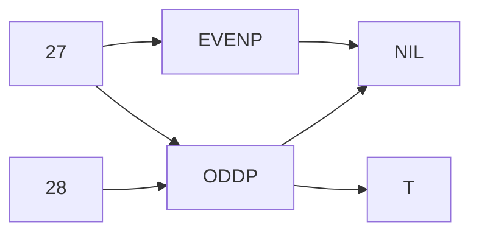
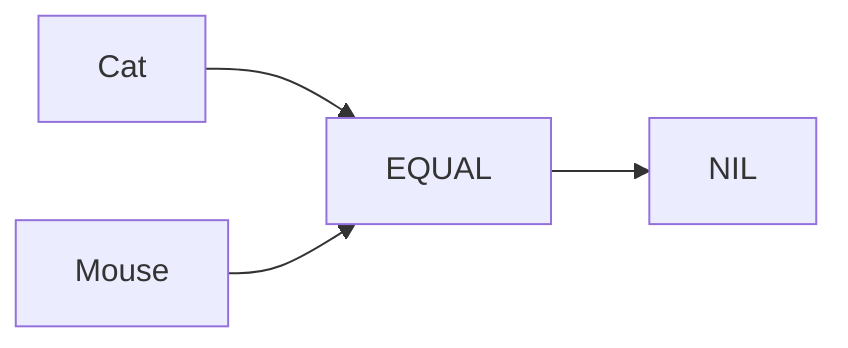

# Functions and Data

<table data-header-hidden><thead><tr><th width="132"></th><th></th></tr></thead><tbody><tr><td>integer</td><td>A sequence of digits ‘‘0’’ through ‘‘9,’’ optionally preceded by a plus or minus sign.</td></tr><tr><td>symbol </td><td>Any sequence of letters, digits, and permissible special characters that is not a number</td></tr></tbody></table>

So FOUR is a symbol, 4 is an integer, + 4 is an integer, but + is a symbol. And 7-11 is also a symbol.\\

### THE SPECIAL SYMBOLS T AND NIL _<mark style="color:blue;">Two Lisp symbols have special meanings attached to them. They are:</mark>_

<table data-header-hidden><thead><tr><th width="143"></th><th></th></tr></thead><tbody><tr><td>T</td><td>Truth, ‘‘yes’’</td></tr><tr><td>NIL</td><td>Falsity, emptiness, ‘‘no’’</td></tr></tbody></table>

T and NIL are so basic to Lisp that if you ask a really dedicated Lisp programmer a yes-or-no question, he may answer with T or NIL instead of English. (‘‘Hey, Jack, want to go to dinner?’’ ‘‘NIL. I just ate.’’) More importantly, certain Lisp functions answer questions with T or NIL. Such yes-or-no functions are called <mark style="color:red;">**predicates**</mark>.

### SOME SIMPLE PREDICATES

A predicate is a question-answering function. Predicates output the symbol T when they mean yes and the symbol NIL when they mean no. The first predicate we will study is the one that tests whether its input is a number or not. It is called <mark style="color:blue;">**NUMBERP**</mark> (pronounced ‘‘**number-pee**,’’ as in ‘‘number predicate’’), and it looks like this:

2 --> NUMBERP --> T

DOG --> NUMBERP --> NIL

Similarly, the <mark style="color:blue;">**SYMBOLP**</mark> predicate tests whether its input is a symbol. SYMBOLP returns T when given an input that is a symbol; it returns NIL for inputs that are not symbols.

CAT --> SYMBOLP --> T

42 --> SYMBOLP --> NIL

The <mark style="color:blue;">**ZEROP, EVENP, and ODDP**</mark> predicates work only on numbers. ZEROP returns T if its input is zero.

35 --> ZEROP --> NIL

0 --> ZEROP --> T

<mark style="color:blue;">**ODDP**</mark> returns T if its input is odd; otherwise it returns NIL. <mark style="color:blue;">**EVENP**</mark> does the reverse\\

### THE EQUAL PREDICATE

<mark style="color:blue;">**EQUAL**</mark> is a predicate for comparing two things to see if they are the same. EQUAL returns T if its two inputs are equal; otherwise it returns NIL. Common Lisp also includes predicates named <mark style="color:blue;">**EQ, EQL, and EQUALP**</mark> whose behavior is slightly different than EQUAL; the differences will not concern us here. For beginners, EQUAL is the right one to use.

